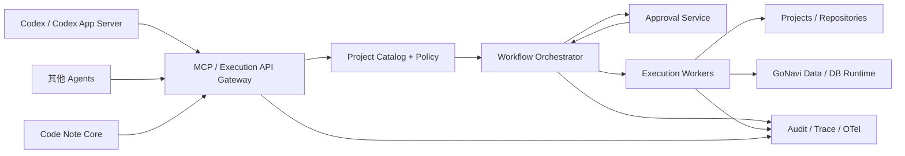
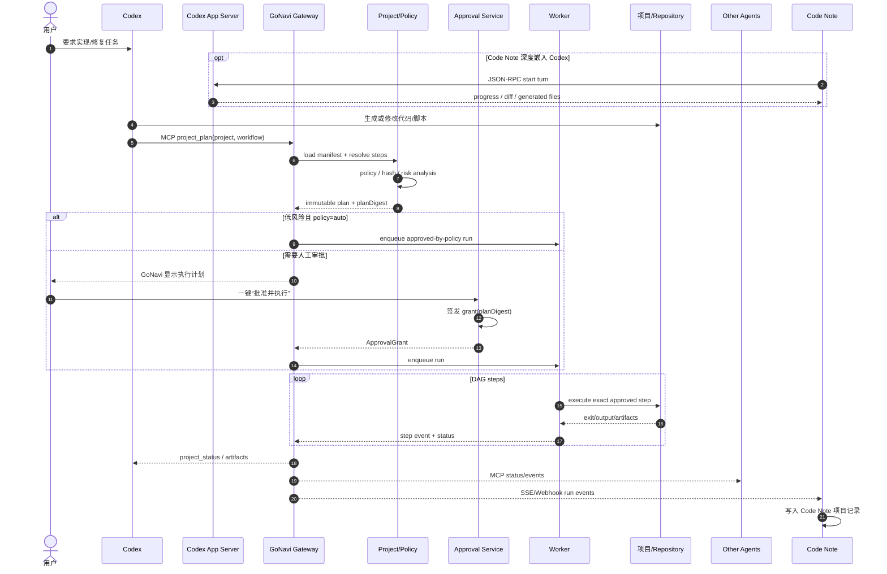
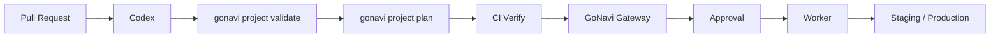
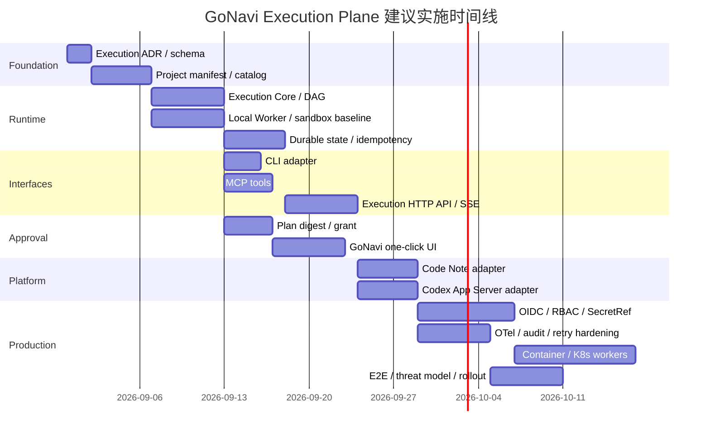

# GoNavi × Codex × Code Note 统一执行层集成研究与实施方案

## 执行摘要

**结论：GoNavi 已具备成为 Codex/Agent 的“数据与受控执行入口”的基础，但当前还不是通用项目执行器；推荐新增独立 `Execution Plane`，以“项目清单 + DAG 工作流 + 不可变执行计划 + 一键审批 + Worker”为核心，并让 MCP、CLI、桌面/Web、Code Note API 全部调用同一执行内核。**

截至本次研究快照，GoNavi 已形成几个与目标高度契合的能力：Wails/Go + React 架构、Headless Runtime、独立 CLI、MCP stdio/Streamable HTTP、Codex MCP 一键安装、SQL 安全策略、审计、请求级 trace、Docker/Kubernetes/Helm/Podman 部署。其 MCP 当前仍是数据库工具集，CLI 当前也是数据库查询、批处理、导出、审计和 MCP 服务，不存在通用 `project_run`/任意项目 DAG 执行能力。citeturn6search0 fileciteturn6file0L1-L7 fileciteturn15file0L1-L2

最值得复用的不是现有 `execute_sql` 本身，而是它背后的架构模式：`MCP → Backend interface → Headless App → 临执行授权 → 审计 → context cancellation`。特别是 `MCPQueryExecutor` 已经把 MCP 调用和桌面/Wails 入口隔离，并在真正执行 SQL 前重新读取连接与 secret、重新做安全策略检查，避免“审批时看到的配置”和“真正执行时的配置”发生 TOCTOU 漏洞。新的项目执行层应复制这一模式，而不是直接在 MCP handler 里 `exec.Command`。fileciteturn9file0L1-L7 fileciteturn12file0L1-L7

对于 Codex，建议明确分成两条链路。**Codex 调用 GoNavi**时继续使用 GoNavi 已支持的 MCP 接入；**Code Note 或 GoNavi 需要深度驱动 Codex 生成代码、接收 diff/状态时**，使用 Codex App Server，而不是把 Codex 当成 MCP server 再二次包装。OpenAI 当前明确把 Codex App Server 定位为首选、持续维护的产品集成协议，它使用双向 JSON-RPC/JSONL，并指出 MCP 对 Codex 的 diff 等丰富会话语义表达不足。citeturn5search0

最终建议结构是：



建议目标不是给 Agent 一个类似：

```text
execute_command("anything the model wants")
```

的万能 shell，而是让所有项目声明：

```text
project_id → workflow → immutable steps → risk policy → approval → execution
```

这样才能同时实现“每个项目一键/全自动执行”“Codex 生成脚本后一键批准”“其他 Agent/Code Note 共用 GoNavi”，而不把 GoNavi 变成一个远程任意命令执行服务。

**本报告采用的无约束假设：**

| 项目 | 假设 |
|---|---|
| GoNavi 部署位置 | 无具体限制；先支持本机/单节点，设计上可迁移 Kubernetes |
| Code Note 部署 | 无具体限制；假定可调用 HTTP API/MCP，可消费 SSE/Webhook |
| 身份提供方 | 无具体限制；生产建议 OIDC/OAuth 2.0 兼容 IdP |
| 项目语言 | 不限定 Go/Node/Python/Java；执行层只负责进程/容器 |
| CI 平台 | 不限定；示例使用 GitHub Actions |
| 项目文件可达性 | Worker 能访问项目工作目录、Git checkout 或挂载目录 |
| Secret 管理 | 无指定产品；接口抽象为 SecretRef，可接 Vault/KMS/K8s Secret/OS Keychain |
| 生产任务隔离 | 允许使用容器；生产环境不建议直接在 GoNavi 主进程执行生成脚本 |
| 审批方式 | 本地 GoNavi GUI/Web 为默认人工审批面；Code Note 可作为第二审批面 |

## GoNavi 当前架构与可扩展边界

### 代码架构判断

GoNavi 当前 README 将自身定义为跨平台、多数据源工作台，核心技术栈为 Go、Wails、React、TypeScript、Vite、Ant Design、Zustand、Monaco；产品同时提供桌面端、实验性 Web Server、MCP HTTP、审计和同步。仓库 `internal/` 已按 AI、App、CLI、DB、MCP、request trace、secret store、SQL audit、sync、Web server 等责任拆包，这使增加 execution domain 比在前端或 MCP handler 内硬编码执行逻辑更符合现有结构。citeturn6search0 fileciteturn25file0L1-L13

| 现有模块 | 当前责任 | 对本方案的价值 | 建议 |
|---|---|---|---|
| `internal/mcpserver` | MCP tools、stdio、Streamable HTTP、认证、schema-only | Agent 接入面 | 增加项目工具，但不直接执行进程 |
| `internal/app` | 应用业务、Headless Runtime、执行安全边界 | execution domain 的设计模板 | 复用 Headless/authorization/audit 思路 |
| `internal/cli` | Headless 查询、batch、export、audit、MCP | CI/脚本入口 | 增加 `project`/`run` 子命令 |
| `internal/ai/service` | AI 设置、外部 MCP 客户端安装 | Codex 一键接入 | 保留并扩展健康检查 |
| `internal/ai/provider` | AI provider，包括 Codex CLI transport | 模型调用 | **不要**作为项目执行器 |
| `internal/requesttrace` | 隐私保护的请求时间线 | execution trace 基础 | 扩展到 run/step trace |
| `internal/sqlaudit` | SQL 审计 | 审计模式模板 | 新增 execution audit |
| `internal/secretstore` / `dailysecret` | Secret 相关基础设施 | 凭据注入 | 只传引用，不传值 |
| `internal/webserver` | 浏览器版 GoNavi bridge/auth | 远程审批 UI | 第一阶段可复用 UI，API 建议独立 |
| `internal/sync*` / `syncjob` | 长任务相关业务域 | 可参考任务化设计 | 不应与通用 executor 强耦合 |
| Docker/K8s/Helm/Podman | MCP/Web 部署 | Worker/Gateway 部署基础 | 增加 executor worker workload |

### MCP 已经做到了什么

当前 `internal/mcpserver/server.go` 注册的工具包括 `get_connections`、`get_databases`、`get_tables`、`get_views`、`get_objects`、`get_all_columns`、`get_columns`、`get_indexes`、`get_foreign_keys`、`get_triggers`、`get_table_ddl`，以及非 `SchemaOnly` 模式下的 `execute_sql`。因此，现有 MCP 的语义是“数据源上下文与 SQL 执行”，而不是“项目/脚本/部署编排”。fileciteturn6file0L1-L7

当前源码对 `execute_sql` 使用 **默认每结果集 50 行、最大 200 行**；这一点比部分 MCP README 中较旧的“默认 200”表述更具体，说明实施时应以源码与测试作为契约真源，并同步清理文档漂移。fileciteturn21file0L1-L2 fileciteturn5file0L1-L2

`SchemaOnly` 是非常值得照搬到 execution domain 的安全设计：远程只需结构上下文时可以完全不注册 `execute_sql`。对应项目执行层建议增加类似：

```go
type ServerOptions struct {
    SchemaOnly       bool
    ExecutionEnabled bool
    ApprovalEnabled  bool
}
```

而不是只依赖工具参数里的 `allow=true`。当前 GoNavi 就是通过“压根不注册工具”实现 schema-only 隔离。fileciteturn6file0L1-L7

### HTTP MCP 基础设施

GoNavi 的 Streamable HTTP MCP 默认监听 `127.0.0.1:8765`、路径 `/mcp`；远程 HTTP 模式强制要求 bearer token，默认禁止非 loopback，只有显式 `AllowNonLoopback` 才允许外部绑定。Bearer token 比较采用 constant-time compare。当前 HTTP server 还设置 Read/Write/Idle 等 timeout、请求 body 限制、`/healthz`，MCP session timeout 为 30 分钟。fileciteturn7file0L1-L7

这部分最近仍在快速加固。例如 PR #1080 已合并，通过 tracking active authenticated requests，使 HTTP shutdown 超时后也不会在在途 handler 尚未结束时提前关闭 backend，并增加 race/regression 测试。fileciteturn26file0L3-L15 fileciteturn26file0L27-L36

同样，之前关于 request body/time limit、元数据取消、部分成功语义等问题已经有对应修复 PR；当前代码里的 `partial`、`warnings`、`retryable`、`cancellationState` 等字段表明 GoNavi 正在向结构化、Agent-friendly 的错误契约发展。PR #1060 对 `get_tables` 的部分元数据失败进行了显式标记；PR #1001 将 MCP request context 向底层 metadata query 传播；PR #978 明确区分“不支持底层取消”的 legacy driver。fileciteturn21file0L1-L2

### Headless CLI 已经比表面上成熟

当前 `internal/cli/cli.go` 已有稳定 exit code：

| Exit code | 当前意义 |
|---:|---|
| `0` | 成功 |
| `2` | 参数/usage |
| `3` | connection |
| `4` | policy denied |
| `5` | execution |
| `6` | cancelled |
| `7` | unknown outcome |

并提供 `mcp`、`list-connections`、`connection add/import`、`query`、`export`、`batch/exec-file`、`audit export` 等命令；成功输出与机器可读 stderr 错误已经刻意分离。fileciteturn15file0L1-L2

仓库已经合并了专门面向 Agent 的 CLI skill PR #947，其中把 JSONL output、exit code、secret env 约定、`--allow-write`、batch、MCP 等作为 Agent contract 文档化。这是一个非常强的信号：**GoNavi 本身已经朝“机器/Agent 可调用的 Headless 服务”演进，不需要另起一个完全独立项目。** fileciteturn27file0L3-L15

### Codex 集成现状

GoNavi 已能检测本机 Codex CLI，并写入 `~/.codex/config.toml`。其 installer 使用固定 server id `gonavi`，默认 startup timeout 60 秒；更新/移动 GoNavi 后还会修复其自己管理的旧 MCP command，同时尽量不覆盖用户无关配置。fileciteturn20file0L1-L2

当前等价配置形态是：

```toml
[mcp_servers.gonavi]
command = "/absolute/path/to/GoNavi"
args = ["mcp-server"]
startup_timeout_sec = 60
```

Windows 安装版可由 GoNavi 自动写成 `GoNavi.exe mcp-server`。fileciteturn5file0L1-L2

有一个容易误用的模块：`internal/ai/provider/codex_cli.go`。它确实启动 Codex CLI，但源码明确声明 Codex CLI 在这里**只是 credentialed model transport，不是 coding agent**；运行时使用临时目录和 read-only sandbox，并主动关闭 shell、MCP、plugins、hooks、multi-agent、web、computer use 等大量能力，同时把 `approval_policy` 设置成 `never`。因此，**不要通过“放开这个 provider 的 shell 权限”实现项目自动执行。** 那会破坏现有 provider 隔离模型。fileciteturn17file0L1-L2

### 当前架构缺口

把已有模块与用户目标逐项对照：

| 目标 | 当前 GoNavi | 缺口 |
|---|---|---|
| Codex 获取 DB/schema | ✔ MCP 已支持 | 基本无需改 |
| Codex 执行 SQL | ✔ 受控 `execute_sql` | 已有安全边界 |
| Codex 执行任意项目 | ✖ | 缺 Project Catalog + Executor |
| 自动多步骤工作流 | ✖ 通用项目层不存在 | 缺 DAG/状态机 |
| Codex 脚本一键审批 | ✖ | 缺 staging/hash/approval |
| Agent 共用 execution layer | PARTIAL MCP 仅 DB | 缺 Execution API |
| Code Note 服务调用 | PARTIAL 可用 MCP HTTP | 缺 S2S identity/RBAC/run API |
| Durable run/job | PARTIAL 特定业务有 job 概念 | 缺通用 durable Run |
| Artifact/log stream | ✖ 通用执行层不存在 | 缺 event/artifact subsystem |
| 多租户权限 | ✖ MCP 当前单 bearer | 缺 OIDC/RBAC/project ACL |

因此，**不建议只“给 MCP 加一个 shell tool”**。这能在两三天内演示，但无法安全满足“所有项目 + 自动化 + 审批 + 多 Agent + Code Note”。

## 推荐目标架构与集成选型

### 集成选项比较

| 方案 | 实现速度 | 一键审批 | Agent 兼容 | Code Note | 安全边界 | 扩展/HA | 结论 |
|---|---:|---:|---:|---:|---:|---:|---|
| 直接扩展 MCP `execute_command` | 快 | 弱 | 高 | 中 | **低** | 低 | 不采用 |
| 仅复用 Web Server invoke | 快-中 | 高 | 低 | 中 | 中 | 中 | 只做 UI，不做核心协议 |
| CLI wrapper + Agent 调进程 | 中 | 中 | 中 | 低-中 | 中 | 低 | 适合 MVP fallback |
| **Execution Core + MCP Adapter + HTTP API** | 中 | **高** | **高** | **高** | **高** | **高** | **推荐** |
| GoNavi + Temporal/Argo 外部编排 | 慢 | 高 | 高 | 高 | 高 | **最高** | 后期大规模可选 |

推荐选择第四种：**所有 execution semantics 进入 GoNavi 内部统一 domain，MCP/HTTP/CLI/UI 都是 adapter。**

不要设计成：

```text
MCPExecutor
HTTPExecutor
CLIExecutor
```

各自有一套安全判断；应设计成：

```text
                  ┌─ MCP Adapter
Execution Core ───┼─ HTTP API Adapter
                  ├─ CLI Adapter
                  └─ Wails/Web UI Adapter
```

这与现有 `MCP Backend → AppBackend → MCPQueryExecutor → App` 的模式一致。fileciteturn9file0L1-L7 fileciteturn12file0L1-L7

### 推荐新增包结构

```text
internal/
  projectcatalog/
    manifest.go
    loader.go
    validator.go

  execution/
    service.go
    plan.go
    run.go
    step.go
    state.go
    errors.go
    policy.go
    idempotency.go

  approval/
    service.go
    grant.go
    digest.go

  worker/
    worker.go
    local_process.go
    container.go
    sandbox.go
    environment.go

  executionstore/
    store.go
    sqlite.go
    postgres.go

  executionapi/
    server.go
    routes.go
    auth.go
    events.go

  executionaudit/
    store.go
    redact.go

internal/mcpserver/
    execution_tools.go

internal/cli/
    project.go
    run.go

frontend/src/
    components/execution/
      ExecutionCenter.tsx
      RunPlan.tsx
      ApprovalPanel.tsx
      StepLog.tsx
```

### 项目必须显式声明可执行能力

推荐每个项目加入 `.gonavi/project.yaml`：

```yaml
apiVersion: gonavi.io/v1alpha1
kind: Project

metadata:
  id: code-note-core
  displayName: Code Note Core

spec:
  root: "."
  defaultRef: main

  workflows:
    verify:
      description: "完整验证"
      approval: auto

      steps:
        - id: install
          run:
            exec: npm
            args: ["ci"]
          timeout: 10m
          network:
            allow:
              - "registry.npmjs.org"

        - id: test
          dependsOn: [install]
          run:
            exec: npm
            args: ["test"]
          timeout: 20m

        - id: build
          dependsOn: [test]
          run:
            exec: npm
            args: ["run", "build"]
          timeout: 20m

    deploy-staging:
      approval: one_click

      steps:
        - id: verify
          uses: workflow:verify

        - id: deploy
          dependsOn: [verify]
          run:
            exec: "./scripts/deploy.sh"
            args: ["staging"]
          secrets:
            - ref: staging/deploy-token
              env: DEPLOY_TOKEN
          network:
            allow:
              - "api.staging.example.internal"

    deploy-prod:
      approval: two_person
      steps:
        - id: deploy
          run:
            exec: "./scripts/deploy.sh"
            args: ["production"]
```

核心原则是 **Agent 只选择 `projectId + workflow + inputs`，而不是提交自由形式 shell**。

### Execution Core 接口

```go
package execution

type RunRequest struct {
    RequestID      string         `json:"requestId"`
    ProjectID      string         `json:"projectId"`
    Workflow       string         `json:"workflow"`
    Ref            string         `json:"ref,omitempty"`
    Inputs         map[string]any `json:"inputs,omitempty"`
    IdempotencyKey string         `json:"idempotencyKey,omitempty"`
    DryRun         bool           `json:"dryRun,omitempty"`

    // 防止读取 project.yaml 后发生替换。
    ExpectedManifestDigest string `json:"expectedManifestDigest,omitempty"`
}

type Plan struct {
    ID             string     `json:"id"`
    ProjectID      string     `json:"projectId"`
    Workflow       string     `json:"workflow"`
    ManifestDigest string     `json:"manifestDigest"`
    PlanDigest     string     `json:"planDigest"`
    Risk           RiskLevel  `json:"risk"`
    Approval       ApprovalMode `json:"approval"`
    Steps          []StepSpec `json:"steps"`
}

type Service interface {
    Plan(ctx context.Context, req RunRequest) (*Plan, error)
    Start(ctx context.Context, planID string, grant *ApprovalGrant) (*Run, error)
    Get(ctx context.Context, runID string) (*Run, error)
    Cancel(ctx context.Context, runID string) error
    Retry(ctx context.Context, runID, stepID string) (*Run, error)
}
```

进程执行器不要默认使用 shell：

```go
func (w *LocalWorker) execute(
    ctx context.Context,
    step StepSpec,
) error {
    dir, err := w.paths.ResolveProjectPath(step.WorkDir)
    if err != nil {
        return err
    }

    // exec + args 分离，避免把任意字符串交给 sh -c / cmd.exe。
    cmd := exec.CommandContext(ctx, step.Exec, step.Args...)
    cmd.Dir = dir

    env, err := w.env.BuildAllowedEnvironment(step)
    if err != nil {
        return err
    }
    cmd.Env = env

    stdout, stderr, err := w.logs.Attach(cmd, step.ID)
    if err != nil {
        return err
    }
    defer stdout.Close()
    defer stderr.Close()

    return cmd.Run()
}
```

`run.shell: true` 可以后期作为显式高风险 capability，而不应成为默认值。

### MCP 新工具

建议第一版只开放六个：

```go
mcp.AddTool(server, &mcp.Tool{
    Name: "project_list",
    Description: "列出允许当前调用者访问的 GoNavi 项目和工作流",
}, svc.ProjectList)

mcp.AddTool(server, &mcp.Tool{
    Name: "project_plan",
    Description: "生成不可变执行计划；不执行任何步骤",
}, svc.ProjectPlan)

mcp.AddTool(server, &mcp.Tool{
    Name: "project_run",
    Description: "启动已批准或策略允许自动执行的计划",
}, svc.ProjectRun)

mcp.AddTool(server, &mcp.Tool{
    Name: "project_status",
    Description: "读取 run 和 step 状态",
}, svc.ProjectStatus)

mcp.AddTool(server, &mcp.Tool{
    Name: "project_cancel",
    Description: "请求取消 run",
}, svc.ProjectCancel)

mcp.AddTool(server, &mcp.Tool{
    Name: "project_artifacts",
    Description: "列出执行产物元数据",
}, svc.ProjectArtifacts)
```

**不建议把 `project_approve` 默认开放给同一个 Agent。** 否则“Agent 发起高风险任务 → Agent 自己批准”会让审批形同虚设。人工审批应进入 Wails/Web UI，或由拥有不同 scope 的 Code Note 服务调用。

### CLI 扩展

在当前 CLI 已经拥有稳定 machine-readable output 与 exit code 的前提下，新增：

```bash
gonavi project list
gonavi project validate --project code-note-core

gonavi project plan \
  --project code-note-core \
  --workflow verify \
  --format json

gonavi project run \
  --project code-note-core \
  --workflow verify \
  --idempotency-key "$CI_RUN_ID"

gonavi run get <run-id>
gonavi run logs <run-id>
gonavi run cancel <run-id>
```

保留现有 exit code，并为 execution domain 复用：

```text
0 DONE
4 POLICY_DENIED
5 EXECUTION_FAILED
6 CANCELLED
7 OUTCOME_UNKNOWN
```

当前 CLI 已经存在 `policy denied/cancelled/unknown outcome` 的表达，因此这不是另建一套异常系统，而是扩大现有契约覆盖范围。fileciteturn15file0L1-L2 fileciteturn27file0L3-L25

## Codex、一键审批与 Code Note 端到端设计

### Codex 的正确角色划分

建议把 Codex 分成：

```text
Codex = 生成 / 修改 / 分析 / 计划
GoNavi = 审批 / 授权 / 调度 / 执行 / 审计
Code Note = 上层编排 / 项目知识 / Agent 协作 / 用户入口
```

Codex 自身已经有 sandbox、approval、network policy、rules 和 OpenTelemetry 等治理机制；OpenAI 当前的实践也是“低风险操作自动，高风险跨边界操作停下来审批”，并强调 bounded execution、network allowlist 和 agent-native telemetry。GoNavi execution plane 应采用同样原则，而不是依赖 prompt 要求模型“谨慎”。citeturn7search0

### Codex → GoNavi 本地模式

GoNavi 当前就可以给 Codex 自动写入 MCP stdio 配置。fileciteturn20file0L1-L2

之后 Codex 工作流变成：

```text
1. Codex 阅读/修改项目
2. Codex 生成 script
3. Codex 调用 gonavi.project_plan
4. GoNavi 对 script + manifest + args 做 hash
5. 低风险 → 自动开始
6. 高风险 → GoNavi 显示“一键批准”
7. 用户批准
8. GoNavi Worker 执行
9. Codex 通过 project_status / artifacts 得到结果
10. Codex 根据失败继续修复
```

### Codex 生成脚本的一键批准协议

不要批准“路径”，例如：

```text
approve .gonavi/generated/migrate.sh
```

因为批准后文件可以被修改。

应该批准：

```json
{
  "runId": "run_01J...",
  "projectId": "code-note-core",
  "planDigest": "sha256:83f3...",
  "manifestDigest": "sha256:bb3a...",
  "artifacts": [
    {
      "path": ".gonavi/generated/20260828/migrate.sh",
      "sha256": "sha256:51e4..."
    }
  ],
  "expiresAt": "2026-08-28T21:30:00Z"
}
```

点击批准后生成：

```go
type ApprovalGrant struct {
    RunID      string    `json:"runId"`
    PlanDigest string    `json:"planDigest"`
    Subject    string    `json:"subject"`
    ApprovedBy string    `json:"approvedBy"`
    Scope      []string  `json:"scope"`
    ExpiresAt  time.Time `json:"expiresAt"`
    Nonce      string    `json:"nonce"`
    Signature  string    `json:"signature"`
}
```

Worker 在执行前必须重新检查：

```text
current script SHA256 == approved artifact SHA256
current plan digest   == approval.planDigest
now                   < approval.expiresAt
approval nonce        unused
actor/project/env     compatible
```

这与 GoNavi 当前 MCP SQL 在“真正 dispatch 之前再次读取连接并重新授权”的设计方向一致。fileciteturn9file0L1-L7 fileciteturn12file0L1-L7

### 一键审批 UI

建议在 GoNavi 增加 `Execution Center`：

```text
┌──────────────────────────────────────────────────┐
│ Codex Generated Run                              │
│ project: code-note-core                          │
│ workflow: codex-generated                        │
│ risk: WRITE / NETWORK                            │
│                                                  │
│ 3 steps                                          │
│ ✔ npm test                                       │
│ ! ./scripts/migrate.sh staging                   │
│ ! ./scripts/deploy.sh staging                    │
│                                                  │
│ Files changed: 2                                 │
│ DB mutations: yes                                │
│ Network: api.staging.example.internal            │
│ Secrets: staging/deploy-token (value hidden)     │
│                                                  │
│ [查看 Diff] [拒绝] [批准并执行]                  │
└──────────────────────────────────────────────────┘
```

GoNavi 的 Web Server 已有 HTTP/SSE bridge、session、setup/auth 等能力，因此 Web 版可以作为远程审批 UI 的第一实现基础；README 同时明确将 Web Server 标为 experimental，并要求生产使用 reverse proxy + HTTPS，因此不建议让其现有通用 bridge 直接成为长期服务间 execution API。citeturn6search0

### 端到端时序



### Code Note 作为共享调用者

Code Note 不应该 shell-out：

```text
gonavi project run ...
```

作为生产主通路，而应调用一个稳定的 Execution API：

```text
POST /v1/projects/{projectId}/plans
POST /v1/plans/{planId}/runs
POST /v1/runs/{runId}/approvals
GET  /v1/runs/{runId}
GET  /v1/runs/{runId}/events
POST /v1/runs/{runId}/cancel
GET  /v1/runs/{runId}/artifacts
```

建议 event stream 使用 SSE，控制命令普通 JSON HTTP；Agent 侧继续使用 MCP。这样 MCP 负责“LLM 友好的工具语义”，HTTP API 负责“服务级稳定 contract”。

Code Note adapter 可以保持极薄：

```ts
export class GoNaviExecutionClient {
  constructor(
    private readonly baseUrl: string,
    private readonly tokenProvider: () => Promise<string>,
  ) {}

  async createPlan(projectId: string, body: {
    workflow: string;
    ref?: string;
    inputs?: Record<string, unknown>;
    idempotencyKey?: string;
  }) {
    const token = await this.tokenProvider();

    const response = await fetch(
      `${this.baseUrl}/v1/projects/${encodeURIComponent(projectId)}/plans`,
      {
        method: "POST",
        headers: {
          authorization: `Bearer ${token}`,
          "content-type": "application/json",
        },
        body: JSON.stringify(body),
      },
    );

    if (!response.ok) {
      throw new Error(`GoNavi createPlan failed: ${response.status}`);
    }

    return response.json();
  }
}
```

### Code Note 驱动 Codex 的方式

对于 Code Note 内嵌 Codex，不建议通过：

```text
Code Note → MCP → Codex MCP Server
```

作为主设计，因为 OpenAI 明确指出 MCP 映射不了所有 Codex-specific session semantics，尤其是 diff/progress 等丰富交互；推荐：

```text
Code Note
   ├── Codex App Server → 生成/修改/实时 diff
   └── GoNavi Execution API → 批准/执行/日志/状态
```

Codex App Server 是双向 JSON-RPC/JSONL，OpenAI 还提供从协议生成 TypeScript definition/JSON Schema 的方式，适合 Code Note 这种平台级集成。citeturn5search0

### AI 扩展路线与该设计兼容

GoNavi 自己的 `AI_EXTENSIONS_ROADMAP.md` 已提出把 AI 工具拆成 `tool registry`、MCP server config、runtime bridge，并把 Skill 定义为“prompt + tool dependencies + usage entry”。这与新增 execution tool registry/project workflow 非常相容。建议不要让 Execution Plane 直接依赖当前前端 `LOCAL_TOOLS`，而是推进统一后端 registry。fileciteturn22file0L1-L7

## 权限、安全、失败恢复与可观测性

### 当前认证能力与需要补的层

当前 MCP HTTP 使用一个必需的 bearer token；默认 loopback，非 loopback 需要明确打开。这个模型足以做单用户/单服务，但 token 本身不表达“谁”“哪个项目”“是否有 approve 权限”。fileciteturn7file0L1-L7

因此生产环境建议：

```text
Client
  │ OAuth2/OIDC access token
  ▼
Execution Gateway
  │ validate issuer/aud/exp/scopes
  │ map subject → project ACL
  ▼
Execution Core
  │ immutable ActorContext
  ▼
Worker
```

推荐 scope：

| Scope | 用途 |
|---|---|
| `projects.read` | 项目/工作流发现 |
| `runs.plan` | 生成计划 |
| `runs.execute.low` | 执行自动批准低风险任务 |
| `runs.execute.write` | 执行有写入能力计划 |
| `runs.approve` | 人工/服务审批 |
| `runs.cancel` | 取消任务 |
| `runs.logs.read` | 查看日志 |
| `artifacts.read` | 下载产物 |
| `db.schema.read` | GoNavi DB schema |
| `db.query.read` | 只读查询 |
| `db.mutate` | 数据变更 |

推荐角色：

| 身份 | Scope |
|---|---|
| Codex local | read/plan/execute-low/status，**无 approve** |
| 普通 Agent | read/plan/status |
| Code Note orchestrator | read/plan/execute/status |
| Code Note approval service | approve，单独 service identity |
| 本地用户 | 按 GoNavi GUI 登录身份授权 |
| CI runner | 指定 project/environment 的最小 scope |
| Production approver | approve + 特定 prod project |

服务到服务建议 OIDC/OAuth client credentials 或工作负载 identity；Worker 与 control plane 可再加 mTLS。

OpenAI 当前对 Codex 企业安全的做法也把 identity、secure credential store、sandbox、network policy、approval、managed configuration 和 OTel telemetry 作为不同控制层，而不是只依赖单一登录 token。citeturn7search0

### 审批策略

建议四档：

| 模式 | 示例 | 行为 |
|---|---|---|
| `auto` | lint、test、read-only inspection | 自动执行 |
| `one_click` | workspace 写入、staging deploy、DB mutation | 单人一键批准 |
| `two_person` | production deployment/destructive migration | 双人审批 |
| `deny` | 禁止路径、未知 shell、特定危险命令 | 不允许执行 |

风险计算不要只看 workflow 名称，应结合：

```text
filesystem writes
network access
secret access
database mutation
production target
container privilege
shell=true
unknown executable
artifact overwrite
destructive patterns
```

OpenAI 当前也采用“sandbox + approval policy + command rules + network allowlist”的多层方式，低风险动作可以减少打断，高风险越界行为必须显式授权。citeturn7search0

### Script 安全边界

Codex 生成的脚本视为**未受信任输入**。

必须做：

```text
生成 → 暂存 → 解析 → policy scan → SHA256 → plan digest
                                      ↓
                                  用户审批
                                      ↓
                              hash 再验证
                                      ↓
                                 Worker
```

禁止把 secret 写进：

```text
project.yaml
Codex prompt
审批 UI
MCP response
argv
execution log
artifact manifest
```

GoNavi 当前 CLI 已经在连接添加中明确避免敏感参数直接走 argv，并提供 env-based secret conventions；requesttrace 更进一步，源码注释明确声明只保存 summary，不保存 request body、SQL text、result rows、connection URLs 或 credentials。这两个既有原则应扩大到 execution log。fileciteturn15file0L1-L2 fileciteturn30file0L1-L2

### 文件系统与命令隔离

最低要求：

```text
canonicalize project root
resolve symlinks
reject path escape
exec + args 分离
shell disabled by default
env allowlist
secret references only
timeout per step
stdout/stderr size limits
artifact glob allowlist
```

生产推荐 Worker 进入容器：

```text
read-only root filesystem
project workspace mount
no-new-privileges
non-root user
CPU/memory/pid limit
network deny by default
explicit egress allowlist
short-lived secret mount
```

这与 Codex 默认限制 workspace、默认限制 network、允许按项目配置网络访问的安全设计一致。citeturn7search0turn7search4

### 状态模型

不要只返回 `success: true/false`。

建议：

```text
QUEUED
PLANNING
WAITING_APPROVAL
RUNNING
RETRY_WAIT
SUCCEEDED
PARTIAL
FAILED
CANCEL_REQUESTED
CANCELLED
UNKNOWN_OUTCOME
```

GoNavi 当前 MCP 已开始把 `partial`、`warnings`、`retryable`、`truncated` 作为元数据工具的结构化字段；这比把 partial failure 包装为普通 success 更适合 Agent。fileciteturn21file0L1-L2

`UNKNOWN_OUTCOME` 尤其要保留。当前 CLI 已有 exit code 7，现有 query cancellation 路径也专门处理底层是否真正支持 cancellation；因此生产部署、数据库 mutation、远程 API 调用在连接断掉时不能简单标成 FAILED 后自动重跑。fileciteturn15file0L1-L2

### Retry 规则

推荐按 step 显式定义：

```yaml
retry:
  maxAttempts: 3
  backoff: exponential
  initialDelay: 1s
  maxDelay: 30s
  on:
    - transient_network
    - rate_limited
    - worker_lost
```

默认：

```text
read-only + idempotent   → 可自动重试
build/test               → 可重试
HTTP GET                 → 可重试
database mutation        → 默认不重试
deploy                   → 默认不重试
unknown outcome          → 禁止自动重试
policy denied            → 永不重试
invalid manifest         → 永不重试
```

每一个可重试 step 应支持：

```yaml
idempotency:
  key: "${run.id}:${step.id}"
```

对于外部系统，传递相同 idempotency key。

### Request Trace 的复用

现有 `requesttrace.Store` 已经包含：

```text
RequestID
Entry
Operation
DataSourceType
DriverMode
Deadline
Started/Finished/Duration
Status
Cancellation requested/accepted/outcome
ResponseBytes
Pagination
RetryCount
Error
Events
```

而且 capacity 有界、进程内存态、默认只保存脱敏 summary。项目执行层可以直接升级这一 schema，而不是重新发明日志关联 ID。fileciteturn30file0L1-L2

建议 execution trace 增加：

```text
trace_id
run_id
plan_id
project_id
workflow
step_id
actor.subject
source = codex|agent|code-note|cli|ui|ci
worker_id
queue_wait_ms
approval_wait_ms
attempt
exit_code
artifact_count
```

### OpenTelemetry

建议将 GoNavi trace 与 Codex trace 都接入同一个 OTLP collector：

```text
Codex ───────┐
GoNavi API ──┼──> OTel Collector ──> Grafana/Loki/Tempo / SIEM
Worker ──────┘
```

OpenAI 当前 Codex 支持对用户 prompt、tool approval、tool execution、MCP usage、network policy 等事件进行 OpenTelemetry log export，因此 Code Note 可以通过 `traceparent/request_id/run_id` 将“为什么 Codex 发起任务”和“GoNavi 实际执行了什么”连接起来。citeturn7search0

建议指标：

| 指标 | 用途 |
|---|---|
| `gonavi_runs_total` | 总任务与状态 |
| `gonavi_run_duration_seconds` | 工作流耗时 |
| `gonavi_step_duration_seconds` | 步骤耗时 |
| `gonavi_queue_depth` | 调度压力 |
| `gonavi_approval_wait_seconds` | 人工瓶颈 |
| `gonavi_retry_total` | Retry 健康 |
| `gonavi_unknown_outcome_total` | 高风险异常 |
| `gonavi_worker_active` | Worker 利用率 |
| `gonavi_policy_denied_total` | 安全策略命中 |
| `gonavi_artifact_bytes` | 存储容量 |

## CI/CD、编排和规模化设计

### CI 的推荐工作流

GoNavi 本身已经使用 GitHub Actions、多架构 release，并已有 Docker/Kubernetes/Helm/Podman 部署路径。citeturn6search0

对于用户项目，推荐：



GitHub Actions 示例：

```yaml
name: gonavi-verify

on:
  pull_request:
  workflow_dispatch:

jobs:
  verify:
    runs-on: self-hosted

    steps:
      - uses: actions/checkout@v4

      - name: Validate GoNavi project manifest
        run: |
          gonavi project validate \
            --project code-note-core

      - name: Create execution plan
        run: |
          gonavi project plan \
            --project code-note-core \
            --workflow verify \
            --format json \
            > gonavi-plan.json

      - name: Execute verified workflow
        env:
          GONAVI_ACCESS_TOKEN: ${{ secrets.GONAVI_ACCESS_TOKEN }}
        run: |
          gonavi project run \
            --project code-note-core \
            --workflow verify \
            --idempotency-key "${GITHUB_RUN_ID}-${GITHUB_RUN_ATTEMPT}"
```

成熟版本应避免长期 `GONAVI_ACCESS_TOKEN`，而让 CI 使用 OIDC workload identity 换短期 execution token。

### Control Plane / Worker 分离

第一阶段可以：

```text
GoNavi process
 ├ project catalog
 ├ execution service
 ├ sqlite run store
 └ local worker
```

生产应逐渐拆成：

```text
                    ┌── Worker A: Linux/Node
Gateway → Queue ────┼── Worker B: Go/Java
                    ├── Worker C: DB migration
                    └── Worker D: prod-isolated
       │
       ├── PostgreSQL run state
       └── Object storage artifacts
```

这样 GoNavi GUI 的生命周期不会决定长任务生命周期。

### Durable Run

第一版至少应保证：

```text
run accepted
→ state persisted
→ queue record persisted
→ worker claim
→ lease heartbeat
→ completion persisted
```

而不是：

```go
go executeWorkflow(...)
```

然后只存在内存中。

推荐数据模型：

```sql
runs(
  id,
  project_id,
  workflow,
  plan_digest,
  actor_subject,
  status,
  created_at,
  started_at,
  finished_at
)

run_steps(
  run_id,
  step_id,
  attempt,
  status,
  worker_id,
  exit_code,
  started_at,
  finished_at
)

approvals(
  run_id,
  plan_digest,
  approver,
  scope,
  expires_at,
  signature
)

artifacts(
  run_id,
  step_id,
  name,
  digest,
  storage_uri,
  size
)
```

### Worker 规模化

建议三个阶段：

| 阶段 | Worker | 状态库 | Queue | 适用 |
|---|---|---|---|---|
| MVP | local subprocess | SQLite | in-process durable queue | 单人/本机 |
| Team | container worker | PostgreSQL | Postgres/NATS/Redis | Code Note 团队 |
| Scale | K8s Job/worker pool | PostgreSQL | NATS/Kafka/Redis | 多项目/多环境 |

不要第一天引入 Temporal；先把 `ExecutionBackend` 抽象清楚：

```go
type Scheduler interface {
    Enqueue(ctx context.Context, runID string) error
    Cancel(ctx context.Context, runID string) error
}

type WorkerBackend interface {
    Execute(ctx context.Context, lease Lease, step StepSpec) StepResult
}
```

后续可加：

```text
LocalScheduler
KubernetesScheduler
TemporalScheduler
ArgoScheduler
```

而 MCP/API contract 不变。

### 并发控制

需要至少四层：

```text
global worker concurrency
per-project concurrency
per-workflow concurrency
resource/environment locks
```

Manifest 示例：

```yaml
concurrency:
  group: "deploy:${environment}"
  maxParallel: 1
  cancelInProgress: false
```

数据库 migration、生产 deploy 等应使用：

```text
exclusive resource lock
```

防止两个 Agent 同时操作同一环境。

### Artifact 设计

Agent 不应该把几十 MB 构建日志或 test report 直接塞回 MCP context。

MCP 只返回：

```json
{
  "runId": "run_123",
  "status": "FAILED",
  "summary": "2 tests failed",
  "artifacts": [
    {
      "id": "artifact_456",
      "name": "test-report.json",
      "size": 82311,
      "sha256": "..."
    }
  ]
}
```

需要时再调用 `project_artifacts` 或 HTTP artifact API。

这与 GoNavi 当前 `execute_sql` 故意限制 result row 数、避免把大数据灌进 Agent context 的原则一致。fileciteturn21file0L1-L2

## 实施路线、责任矩阵与迁移清单

### 推荐实施顺序

**第一优先级不是写 MCP tool，而是先定义 execution contract。**

建议提交顺序：

```text
Project Manifest
    ↓
Execution Core
    ↓
Local Worker
    ↓
Durable State
    ↓
CLI
    ↓
MCP
    ↓
Approval UI
    ↓
Execution HTTP API
    ↓
Code Note Adapter
    ↓
OIDC/RBAC
    ↓
Container/K8s Workers
```

这样每一层都只有一个 execution truth source。

### 组件责任矩阵

| 组件 | 责任 | 不负责 |
|---|---|---|
| Codex | 生成代码/脚本、分析失败、提出执行请求 | 最终安全授权 |
| Codex App Server adapter | Code Note 与 Codex 富会话集成 | 项目执行 |
| GoNavi Project Catalog | 项目/workflow 定义、校验 | 实际进程 |
| Policy Engine | risk、scope、环境判断 | 执行 |
| Approval Service | plan digest 绑定审批 | 改写计划 |
| Orchestrator | DAG、状态、retry、cancel | 直接 shell |
| Worker | 执行 immutable step | 决定审批 |
| MCP Adapter | Agent tools | 保存独立业务状态 |
| Execution HTTP API | Code Note/S2S contract | 业务策略复制 |
| CLI Adapter | 本地/CI interface | 业务策略复制 |
| GoNavi UI/Web | 一键审批、日志、状态 | Worker execution |
| Code Note | 上层 Agent/知识/任务编排 | 绕过 GoNavi policy |
| Secret Provider | 短期 secret material | 把 secret 返回给 Agent |
| OTel/SIEM | 诊断、审计 | 业务授权 |

### 迁移清单与工作量

以下为**工程规划估算**，不是仓库官方工期；假设一名熟悉 Go/React 的高级工程师，已有 GoNavi 开发环境，无大型企业 IdP 审批依赖。

| 任务 | 产出 | 估算 |
|---|---|---:|
| Execution ADR/协议 | Run/Plan/Step/Approval/error schema | 1–2 人日 |
| Project manifest v1alpha1 | YAML schema、loader、validator、digest | 3–4 人日 |
| Project catalog | root discovery、ACL metadata、Git ref | 2–3 人日 |
| Execution Core | DAG/state machine/idempotency | 4–6 人日 |
| Local Worker | process、timeout、env、log streaming | 4–6 人日 |
| Path/symlink hardening | root confinement、canonicalization | 2–3 人日 |
| Durable run store | SQLite implementation + migrations | 3–4 人日 |
| CLI commands | project/run/log/status/cancel | 2–3 人日 |
| MCP execution tools | plan/run/status/cancel/artifacts | 2–4 人日 |
| Approval digest/grant | SHA、nonce、expiry、TOCTOU guard | 3–4 人日 |
| GoNavi Approval UI | plan/diff/risk/one-click | 4–6 人日 |
| Execution HTTP API | JSON API + SSE | 4–6 人日 |
| Code Note adapter | API client + events + status mapping | 3–5 人日 |
| Codex App Server adapter | Code Note rich Codex session | 3–5 人日 |
| Auth/RBAC | JWT/OIDC/scopes/project ACL | 5–8 人日 |
| SecretRef layer | provider abstraction + redaction | 3–5 人日 |
| Request trace integration | run/step trace + correlation | 2–3 人日 |
| OpenTelemetry | traces/logs/metrics exporters | 3–5 人日 |
| Retry/unknown outcome | classifier + test matrix | 2–4 人日 |
| Container Worker | isolation/network/resource limits | 5–8 人日 |
| PostgreSQL + shared queue | team-scale control plane | 5–8 人日 |
| K8s worker backend | jobs/leases/cancellation | 5–10 人日 |
| CI templates | GitHub Actions + self-hosted runner | 2–3 人日 |
| Threat model | abuse cases/security acceptance | 2–3 人日 |
| E2E/regression docs | Codex→approval→run→Code Note | 4–6 人日 |

**MVP：约 25–40 人日。**

MVP 边界建议是：

```text
✔ project manifest
✔ deterministic DAG
✔ local worker
✔ SQLite durable state
✔ CLI
✔ MCP
✔ one-click approval
✔ HTTP API/SSE
✔ Code Note basic adapter
✔ audit/trace

✖ 多租户 HA
✖ K8s distributed worker
✖ Temporal/Argo
✖ two-person enterprise approval
```

**可用于团队生产：约 45–65 人日。**

**含 OIDC、多 Worker、容器隔离、K8s/HA、完整 OTel 与生产安全基线：约 60–90 人日。**

两名有经验工程师并行，比较合理的生产化日历周期是约 **5–8 周**，主要关键路径不是 MCP，而是 approval、durability、sandbox、identity 和失败语义。

### 推荐时间线



### 第一轮可直接实施的仓库改动

建议第一批 PR 控制在可审阅范围内：

**PR A — execution domain skeleton**

```text
internal/projectcatalog/*
internal/execution/*
docs/execution/project-manifest.md
```

验收：

```text
✔ YAML → normalized immutable Plan
✔ DAG cycle detection
✔ path validation
✔ deterministic plan digest
✔ zero process execution
```

**PR B — Local Worker + durable state**

```text
internal/worker/*
internal/executionstore/*
```

验收：

```text
✔ exact exec/args
✔ context timeout
✔ stdout/stderr stream
✔ restart 后 run 状态仍在
✔ UNKNOWN_OUTCOME 不自动重试
```

**PR C — CLI adapter**

```text
internal/cli/project.go
internal/cli/run.go
```

验收：

```text
gonavi project validate
gonavi project plan
gonavi project run
gonavi run get
gonavi run cancel
```

复用现有 CLI output/error/exit code contract。fileciteturn15file0L1-L2

**PR D — MCP adapter**

```text
internal/mcpserver/execution_tools.go
```

增加：

```text
project_list
project_plan
project_run
project_status
project_cancel
project_artifacts
```

保留：

```text
schema-only → execution tools entirely absent
```

**PR E — approval**

```text
internal/approval/*
frontend/src/components/execution/*
```

验收：

```text
✔ script/plan digest
✔ expired grant reject
✔ modified-after-approval reject
✔ nonce reuse reject
✔ one-click approve
```

**PR F — Code Note API**

```text
internal/executionapi/*
```

先使用 GoNavi token/loopback 进行开发；生产 rollout 前再替换为 OIDC gateway。

### 项目迁移清单

每个现有项目接入时执行：

| 检查 | 要求 |
|---|---|
| ✔ 项目标识 | 唯一 `metadata.id` |
| ✔ Root | 解析后不得逃逸允许根目录 |
| ✔ Workflow | 至少有 `verify` |
| ✔ Step command | `exec` 与 `args` 分离 |
| ✔ Dependencies | DAG 无循环 |
| ✔ Timeout | 每 step 必填或继承默认值 |
| ✔ Retry | 明确 idempotency 后才能自动 retry |
| ✔ Network | 默认 deny，按 domain allow |
| ✔ Secret | 只出现 SecretRef |
| ✔ Artifact | 明确允许路径/glob |
| ✔ Approval | deploy/mutation 不可默认 auto |
| ✔ Production | 至少 one-click，推荐 two-person |
| ✔ Logs | secret redaction 测试 |
| ✔ Cancellation | 明确 supported/unsupported/unknown |
| ✔ CI | `project validate` 先于 `project run` |
| ✔ Codex | GoNavi MCP status 可检测 |
| ✔ Code Note | project id ↔ Code Note project id 建立映射 |
| ✔ Audit | run/step/approval 均能按 request ID 追踪 |

### 最终验收标准

三个原始目标可以转成以下可测试 acceptance criteria：

| 用户目标 | DONE 判定 |
|---|---|
| 所有项目由 GoNavi 调用 | 每项目有 manifest；`project_run` 可无人工拼命令执行完整 DAG |
| 每一步自动执行 | DAG dependency 满足后自动调度；无需逐 step 点击 |
| Codex 自动脚本一键执行 | Codex 生成 → plan → GoNavi 显示 hash/diff/risk → 单击批准 → exact artifact 执行 |
| 低风险全自动 | `approval:auto` + policy allow 时零人工操作 |
| 高风险受控 | Agent 无 `runs.approve`；审批 grant 与 plan digest 绑定 |
| Agent 共用 | stdio/HTTP MCP 均调用相同 Execution Core |
| Code Note 共用 | HTTP API/SSE 与 MCP 状态一致 |
| CI 共用 | Headless CLI/API 可在 runner 使用 |
| 错误可恢复 | retryable/permanent/cancelled/unknown outcome 有不同语义 |
| 可观察 | 一个 request/run ID 能关联 Codex、GoNavi、Worker |
| Secret 不外泄 | MCP、日志、approval payload 均无 secret 值 |
| 可扩展 | Worker 与 control plane 可分离，无需改 Agent/API contract |

**最终推荐落点：**

```text
Codex
  │
  ├─ MCP ──────────────┐
  │                    │
Other Agents ─ MCP ────┤
  │                    ▼
  │            GoNavi Execution Gateway
  │                    │
Code Note ─ HTTP/SSE ──┤
                       │
                 Project / Policy
                       │
              immutable execution plan
                       │
             auto / one-click approval
                       │
                  Orchestrator
                       │
                Worker Pool
               /     |      \
          Project    DB    Deployment
                       │
                Audit / Trace / OTel
```

这条路线保留 GoNavi 当前最有价值的设计——本地 secret、安全边界、Headless Runtime、MCP、CLI、审计、request trace——同时补上它当前缺失的**通用项目执行语义、审批语义和服务级调用协议**。GoNavi 已证明 MCP、CLI、Headless、Agent client installer 这些基础层可以共存，且近期 PR 持续在强化 cancellation、partial result、HTTP resource limit 和 shutdown lifecycle；在此基础上新增独立 Execution Plane，比把现有 DB MCP 强行改成通用 shell gateway 的架构风险更低。fileciteturn26file0L3-L15 fileciteturn27file0L3-L15 fileciteturn21file0L1-L2

Codex 一侧也应坚持相同分层：**Codex App Server 管理“Agent 生成与交互”，GoNavi 管理“受控执行与审批”，MCP 管理“Agent 调工具”，Code Note 管理“跨 Agent 与项目编排”。** 这一职责边界既利用了 GoNavi 当前原生 MCP/Codex 能力，也符合 OpenAI 当前将 App Server 作为 Codex 产品集成首选协议、将 sandbox/approval/network policy/telemetry 作为执行治理基础的方向。citeturn5search0turn7search0